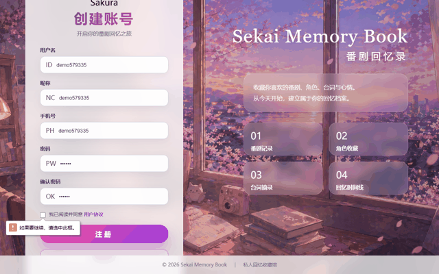

# 馃摎 Sekai Memory Book 路 浜屾鍏冨洖蹇嗗綍

> **璁板綍鐣墽銆佽鑹蹭笌鍙拌瘝鐨勭浜轰簩娆″厓鍥炲繂褰?*
> A private anime memory book 鈥?track anime, characters & quotes

[](https://www.oracle.com/java/)
[](https://spring.io/projects/spring-boot)
[](https://mybatis.org/)
[](https://www.thymeleaf.org/)
[](https://www.mysql.com/)
[](LICENSE)

涓€涓敤浜庤褰曠暘鍓с€佽鑹插拰鍙拌瘝鐨勭浜轰簩娆″厓鍥炲繂褰曪紝鏀寔娉ㄥ唽鐧诲綍銆佹悳绱㈠垎椤典笌鍙拌瘝鎽樺綍銆?
A personal anime memory book: register/login, manage anime & characters, and keep your favorite quotes.

## 鉁?Features / 鍔熻兘

- 鐢ㄦ埛娉ㄥ唽銆佺櫥褰曘€侀€€鍑?User register / login / logout
- **瀵嗙爜甯︾洂鍝堝笇瀛樺偍**锛屽苟鍏煎鏃ф槑鏂囧瘑鐮佽嚜鍔ㄥ崌绾?Salted-hash passwords with legacy plaintext auto-upgrade
- 鐣墽鏂板銆佺紪杈戙€佸垹闄ゃ€佹悳绱€佸垎椤?Anime CRUD + search + pagination
- 瑙掕壊鏀惰棌 Character favorites
- 鍙拌瘝鎽樺綍 Quote collections
- MySQL 寤鸿〃鑴氭湰鍜岀ず渚嬬瀛愭暟鎹?Schema + seed scripts

## 馃搻 Project Structure / 椤圭洰缁撴瀯

```text
sekai-memory-book
鈹溾攢鈹€ build-data/       # 寤鸿〃涓庣瀛愭暟鎹剼鏈?鈹斺攢鈹€ src/main/java     # control / service / dataobject / model 鍒嗗眰
```

## 鈻讹笍 Quick Start / 蹇€熷紑濮?
1. 閰嶇疆鏁版嵁搴撹繛鎺ワ紙鐜鍙橀噺 `DB_PASSWORD`锛?2. 鍒濆鍖栨暟鎹簱锛?
```powershell
mysql -uroot -p --default-character-set=utf8mb4 < build-data\sekai.sql
mysql -uroot -p --default-character-set=utf8mb4 < build-data\user3-anime-seed.sql
mysql -uroot -p --default-character-set=utf8mb4 < build-data\user3-anime-seed-2.sql
mysql -uroot -p --default-character-set=utf8mb4 < build-data\sekai-anime-watch-date.sql
```

3. 鍚姩椤圭洰锛?
```powershell
mvn spring-boot:run
```

4. 娴忚鍣ㄦ墦寮€ `http://localhost:8080`

## 鉁?Verify / 楠岃瘉

```powershell
mvn test
```

## 馃搫 License

[MIT](LICENSE) 漏 2026 [sekai-lyr](https://github.com/sekai-lyr)


<p align="center">
  
</p>
---

**猸?If this project helped you, star it! 濡傛灉杩欎釜椤圭洰瀵逛綘鏈夊府鍔╋紝娆㈣繋 Star锛?*
