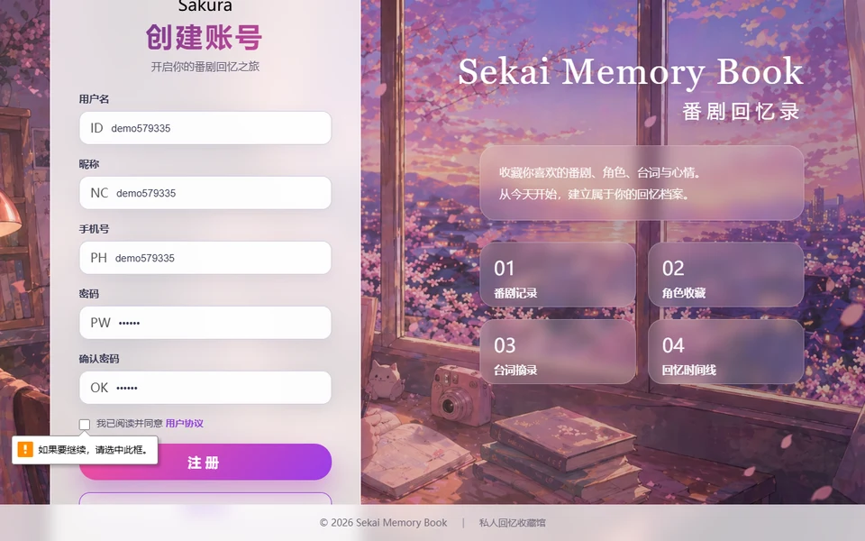

# 📚 Sekai Memory Book · 二次元回忆录

> **记录番剧、角色与台词的私人二次元回忆录**
> A private anime memory book — track anime, characters & quotes

[](https://www.oracle.com/java/)
[](https://spring.io/projects/spring-boot)
[](https://mybatis.org/)
[](https://www.thymeleaf.org/)
[](https://www.mysql.com/)
[](LICENSE)

一个用于记录番剧、角色和台词的私人二次元回忆录，支持注册登录、搜索分页与台词摘录。

A personal anime memory book: register/login, manage anime & characters, and keep your favorite quotes.

## ✨ Features / 功能

- 用户注册、登录、退出 User register / login / logout
- **密码带盐哈希存储**，并兼容旧明文密码自动升级 Salted-hash passwords with legacy plaintext auto-upgrade
- 番剧新增、编辑、删除、搜索、分页 Anime CRUD + search + pagination
- 角色收藏 Character favorites
- 台词摘录 Quote collections
- MySQL 建表脚本和示例种子数据 Schema + seed scripts

## 📐 Project Structure / 项目结构

```text
sekai-memory-book
├── build-data/       # 建表与种子数据脚本
└── src/main/java     # control / service / dataobject / model 分层
```

## ▶️ Quick Start / 快速开始

1. 配置数据库连接（环境变量 `DB_PASSWORD`）
2. 初始化数据库：

```powershell
mysql -uroot -p --default-character-set=utf8mb4 < build-data\sekai.sql
mysql -uroot -p --default-character-set=utf8mb4 < build-data\user3-anime-seed.sql
mysql -uroot -p --default-character-set=utf8mb4 < build-data\user3-anime-seed-2.sql
mysql -uroot -p --default-character-set=utf8mb4 < build-data\sekai-anime-watch-date.sql
```

3. 启动项目：

```powershell
mvn spring-boot:run
```

4. 浏览器打开 `http://localhost:8080`

## ✅ Verify / 验证

```powershell
mvn test
```

## 📄 License

[MIT](LICENSE) © 2026 [sekai-lyr](https://github.com/sekai-lyr)

<p align="center">
  
</p>

---

**⭐ If this project helped you, star it! 如果这个项目对你有帮助，欢迎 Star！**
